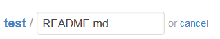

# GitHub中readme.md文件的编辑和使用


## 引言

README文件后缀名为md。md是markdown的缩写，该文件用来测试和展示书写README的各种markdown语法。GitHub的markdown语法在标准的markdown语法基础上做了扩充，称之为GitHub Flavored Markdown。简称GFM，GFM在GitHub上有广泛应用，除了README文件外，issues和wiki均支持markdown语法。
这里只介绍最常用和最常见的功能，若想查看全部的语法，请移步<http://wowubuntu.com/markdown/index.html>

## 开始编辑README

打开你的GitHub的某个项目，我们可以直接在线编辑你的README文件，如果你已经有了这个文件，则在文件目录中直接点击它，如果你还没有这个文件那么点击项目右边的一个按钮create new file，来添加新文件：

然后你就打开了编辑页面，编辑区的左上角有填写文件名的区域，注意加上后缀.md

如果你本来就有这个文件要重新编辑它的话，那么在点击了文件目录中的该文件后，在上方有工具栏，选择Edit

然后滚动屏幕到下面，如果是新文件会有一个Commit new file的按钮，若没有内容是不能点击的。如果是旧文件重修编辑，那么这个按钮显示的是 Commit changes
[](https://yuuichung.github.io/images/hexo-readme/4.png)
先随便写的东西把这个新文件提交，然后再点击 Edit 重新打开它。你会发现编辑区左上角有了变化。
[](https://yuuichung.github.io/images/hexo-readme/5.png)
默认选中Code，即我们的编辑模式。若点击 Preview（预览）就能实时显示当前的显示效果了。

## 语法

#### 关于标题

规范的README文件开头都写上一个标题，这被称为大标题。

```
大标题  
====
```


在文本下面加上 等于号 = ，那么上方的文本就变成了大标题。等于号的个数无限制，但一定要大于0个哦。。
比大标题低一级的是中标题，也就是显示出来比大标题小点。

```
中标题  
-------
```


在文本下面加上 下划线 - ，那么上方的文本就变成了中标题，同样的 下划线个数无限制。
除此之外，你也会发现大，中标题下面都有一条横线，没错这就是 = 和 - 的显示结果。
如果你只输入了等于号=，但其上方无文字，那么就只会显示一条直线。如果上方有了文字，但你又只想显示一条横线，而不想把上方的文字转义成大标题的话，那么你就要在等于号=和文字直接补一个空行。
补空行：是很常用的用法，当你不想上下两个不同的布局方式交错到一起的时候，就要在两种布局之间补一个空行。
如果你只输入了短横线（减号）-，其上方无文字，那么要显示直线，必须要写三个减号以上。不过与等于号的显示效果不同，它显示出来时虚线而不是实线。同减号作用相同的还有星号*和下划线_，同样的这两者符号也要写三个以上才能显示一条虚横线。
除此以外，关于标题还有等级表示法，分为六个等级，显示的文本大小依次减小。不同等级之间是以井号 # 的个数来标识的。一级标题有一个 #，二级标题有两个# ，以此类推。

```
#一级标题  
##二级标题  
###三级标题  
####四级标题  
#####五级标题  
######六级标题
```


注意井号#和标题名称要并排写作一行，显示效果如图：
[](https://yuuichung.github.io/images/hexo-readme/6.png)
实际上，前文所述的大标题和中标题是分别和一级标题和二级标题对应的。即大标题大小和一级标题相同，中标题大小和二级标题相同。

#### 显示文本

##### 普通文本

直接输入的文字就是普通文本。需要注意的是要换行的时候不能直接通过回车来换行，需要使用br>。也就是html里面的标签。事实上，markdown支持一些html标签，你可以试试。当然如果你完全使用html来写的话，就丧失意义了，毕竟markdown并非专门做前端的，然而仅实现一般效果的话，它会比html写起来要简洁得多得多啦。

```
这是一段普通的文本，  
直接回车不能换行，<br>  
要使用\<br>
```


第三行的\br>前加了反斜杠 \ 。目的就是像其他语言那样实现转义，也就是 < 的转义。
效果如图：
[](https://yuuichung.github.io/images/hexo-readme/7.png)
此外，要显示一个超链接的话，就直接输入这个链接的URL就好了。显示出来会自动变成可链接的形式的。

显示空格的小Tip
默认的文本行首空格都会被忽略的，但是如果你想用空格来排一下版的话怎么办呢，有个小技巧，那就是把你的输入法由半角改成全角就OK啦。

##### 单行文本

使用两个Tab符实现单行文本。

```
Hello,大家好，我是果冻虾仁。
```


注意前面有两个Tab。在GitHub上单行文本显示效果如图：
[](https://yuuichung.github.io/images/hexo-readme/8.png)

##### 多行文本

多行文本和单行文本异曲同工，只要在每行行首加两个Tab

```
欢迎到访  
很高兴见到您  
祝您，早上好，中午好，下午好，晚安
```


[](https://yuuichung.github.io/images/hexo-readme/9.png)

#### 换行

直接回车不能换行，
可以在上一行文本后面补两个空格，
这样下一行的文本就换行了。
或者就是在两行文本直接加一个空行。
也能实现换行效果，不过这个行间距有点大。

#### 部分文字的高亮

如果你想使一段话中部分文字高亮显示，来起到突出强调的作用，那么可以把它用 ``包围起来。注意这不是单引号，而是Tab上方，数字1左边的按键（注意使用英文输入法）。

```
Thank `You` . Please `Call` Me `Coder`
```


[](https://yuuichung.github.io/images/hexo-readme/10.png)

#### 文字超链接

给一段文字加入超链接的格式是这样的 [要显示的文字 ](https://yuuichung.github.io/2018/06/06/hexo-readme/%E9%93%BE%E6%8E%A5%E7%9A%84%E5%9C%B0%E5%9D%80)。比如：

```
[我的博客](http://blog.csdn.net/guodongxiaren)
```


显示效果：
[](https://yuuichung.github.io/images/hexo-readme/11.png)
你还可以给他加上一个鼠标悬停显示的文本。

```
[我的博客](http://blog.csdn.net/guodongxiaren "悬停显示")
```


即在URL之后 用双引号括起来一个字符串。同样要注意这里是英文双引号。

#### 插入符号

##### 圆点符

这是一个圆点符
这也是一个圆点符
上面这段的圆点是CSDN博客编辑器里面的符号列表。写文章在列出条目时经常用到。在GitHub的markdown语法里也支持使用圆点符。编辑的时候使用的是星号 *

```
* 昵称：果冻虾仁  
* 别名：隔壁老王  
* 英文名：Jelly
```


要注意的是星号* 后面要有一个空格。否则显示为普通星号。上文的显示效果如图：
[](https://yuuichung.github.io/images/hexo-readme/12.png)
此外还有二级圆点和三级圆点。就是多加一个Tab。

```
* 编程语言  
    * 脚本语言  
        * Python
```


第二行一个Tab，第三行两个Tab。这样用来表示层级结构就更清晰了吧，看效果：
[](https://yuuichung.github.io/images/hexo-readme/13.png)
如果你觉得三级的结构还不够表达清楚的话，我们可以试着换一种形式，请看字符包围

#### 缩进

缩进的含义是很容易理解的。。

```
>数据结构  
>>树  
>>>二叉树  
>>>>平衡二叉树  
>>>>>满二叉树
```


显示效果：
[](https://yuuichung.github.io/images/hexo-readme/14.png)
具体这个“缩进”的用法。大家自己摸索吧。

#### 锚点

其实呢，每一个标题都是一个锚点，和HTML的锚点（#）类似，比如我们

```
[回到顶部](#readme)
```


不过要注意，标题中的英文字母都被转化为小写字母了。
以前GitHub对中文支持的不好，所以中文标题不能正确识别为锚点，但是现在已经没问题啦！

#### 插入图片

##### 来源于网络的图片

网上有很多README插入图片的教程了，经我自己多次测试呢，发现可以使用的最简单，最基本的语法是：

```

```


即 叹号! + 方括号[ ] + 括号( ) 其中叹号里是图片的URL。
如果不加叹号! ,就会变成普通文本baidu了。
在方括号里可以加入一些 标识性的信息，比如

```

```


这个方括号里的baidu并不会对图像显示造成任何改动，如果你想达到鼠标悬停显示提示信息，那么可以仿照前面介绍的文本中的方法，就是这样：

```

```


在URL后面，加一个双引号包围的字符串，显示效果如图：
[](https://yuuichung.github.io/images/hexo-readme/15.png)

##### GitHub仓库里的图片

有时候我们想显示一个GitHub仓库(或者说项目)里的图片而不是一张其他来源网络图片，因为其他来源的URL很可能会失效。那么如何显示一个GitHub项目里的图片呢？
其实与上面的格式基本一致的，所不同的就是括号里的URL该怎么写。
<https://github.com/> 你的用户名 / 你的项目名 / raw / 分支名 / 存放图片的文件夹 / 该文件夹下的图片
这样一目了然了吧。比如：

```

```


我在GitHub上的用户名guodongxiaren；有一个项目ImageCache；raw表示原数据的意思吧，不用管它；主分支master；项目里有一个文件夹Logo；Logo文件夹下有一张图片foryou.gif

##### 给图片加上超链接

如果你想使图片带有超链接的功能，即点击一个图片进入一个指定的网页。那么可以这样写：

```
[![baidu]](http://baidu.com)  
[baidu]:http://www.baidu.com/img/bdlogo.gif "百度Logo"
```


这两句和前面的写法差异较大，但是也极易模仿着写出，就不过多介绍了。只需注意上下文中的 baidu 是你自己起的标识的名称，可以随意，但是一定要保证上下两行的 标识 是一致的。
这样就能实现 点击图片进入网页的功能了。

#### 插入代码片段

我们需要在代码的上一行和下一行用``` 标记。`不是三个单引号，而是数字1左边，Tab键上面的键。要实现语法高亮那么只要在` 之后加上你的编程语言即可（忽略大小写）。c++语言可以写成c++也可以是cpp。看代码：
[](https://yuuichung.github.io/images/hexo-readme/16.png)
实际显示效果
[](https://yuuichung.github.io/images/hexo-readme/17.png)

## 参考

github：<https://github.com/guodongxiaren/README>